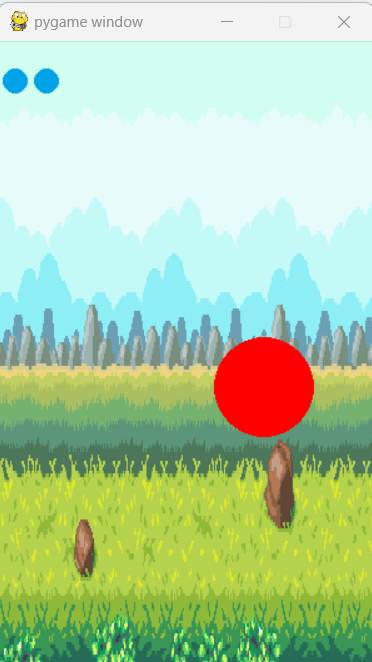

# Pygame Apple Catcher

## Overview

This simple Pygame project involves a player character trying to catch falling apples. The game is implemented in Python using the Pygame library.

## Prerequisites

- Python 3.x
- Pygame library

## Getting Started

1. **Installation:**
   Ensure you have Python 3.x installed. Install the Pygame library using the following command:

   ```bash
   pip install pygame

## Screen Shots:



## Gameplay:
1. The player character is represented by a red circle.
2. Apples fall from the top of the screen.
3. Use the 'W', 'A', 'S', 'D' keys to move the player character.
4. The goal is to catch the falling apples.
